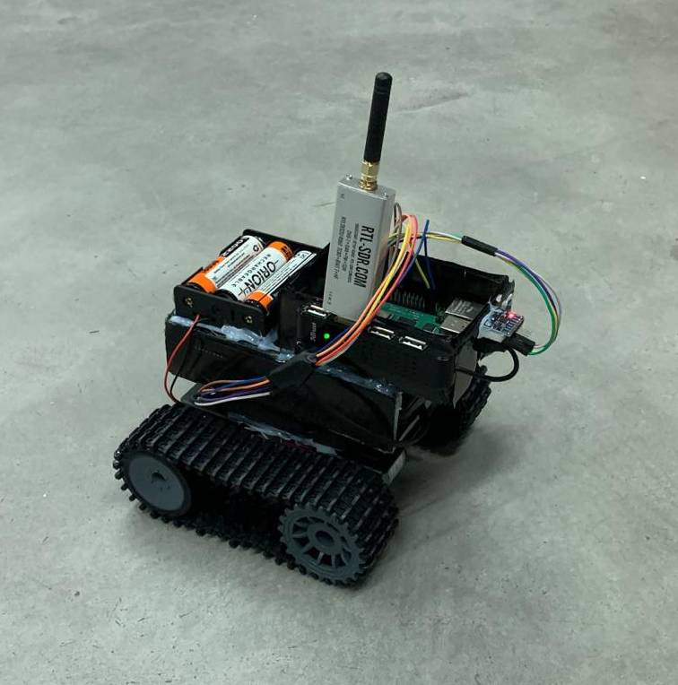

# RFTracker

RFTracker is a radio frequency signal tracking robot built on a Raspberry Pi platform. The system autonomously locates and navigates toward RF signal sources using an RTL-SDR receiver.

## Features

- Autonomous RF signal source tracking
- Real-time signal strength analysis
- Gyroscope-based precise movement control
- Bluetooth connectivity for remote control and monitoring
- PID controllers for smooth navigation

## Hardware Requirements

- Raspberry Pi
- RTL-SDR dongle
- MPU6050 gyroscope
- Motor controller
- Chassis with motors
- Bluetooth adapter

## Software Dependencies

Before running the project, install the required dependencies using the provided requirements.txt file:

```bash
pip3 install -r requirements.txt
```

## Software Architecture

The system is built using several modular components:

- **Vehicle Control**: Handles motor control with PID stabilization
- **SDR Module**: Processes radio signals and analyzes signal strength
- **Gyroscope**: Provides orientation and rotation data
- **Bluetooth Module**: Enables remote control and data transmission
- **PID Controllers**: Maintain stable movement and precise turns

## Operation

1. The robot performs an initial scan by rotating in place to locate the general direction of the strongest signal
2. It then moves toward the detected signal using a series of forward movements and directional corrections
3. A circular buffer stores signal measurements to track progress and avoid oscillations
4. The system continuously refines its path using half-scans to adjust direction

## Usage

Run the main application:
```bash
python src/main.py
```

Connect via Bluetooth to monitor progress or send commands:
- "START" - Begin tracking operation
- "STOP" - Stop the current tracking operation



## Development

The project includes test scripts to verify individual components:
- Bluetooth communication
- Gyroscope calibration
- Vehicle movement
- SDR signal reception

## License

This project is licensed under the MIT License - see the LICENSE file for details.
